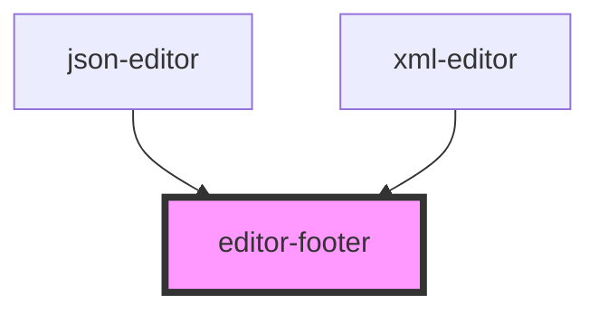

# editor-footer

<!-- Auto Generated Below -->

## Properties

| Property          | Attribute          | Description | Type                           | Default     |
| ----------------- | ------------------ | ----------- | ------------------------------ | ----------- |
| `backgroundColor` | `background-color` |             | `string`                       | `undefined` |
| `color`           | `color`            |             | `string`                       | `undefined` |
| `cursorPosition`  | --                 |             | `{ ln: number; col: number; }` | `undefined` |

## Dependencies

### Used by

 - [json-editor](../json-editor)
 - [xml-editor](../xml-editor)

### Graph

----------------------------------------------

*Built with [StencilJS](https://stenciljs.com/)*
