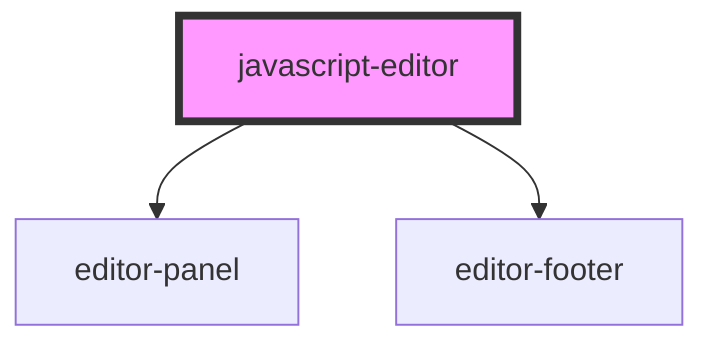

# json-editor

<!-- Auto Generated Below -->

## Properties

| Property           | Attribute            | Description                                                   | Type                                                                                                                                                                                                                                  | Default     |
| ------------------ | -------------------- | ------------------------------------------------------------- | ------------------------------------------------------------------------------------------------------------------------------------------------------------------------------------------------------------------------------------- | ----------- |
| `footerConfig`     | --                   | Configuration for the editor footer                           | `{ backgroundColor: string; color: string; }`                                                                                                                                                                                         | `undefined` |
| `readonly`         | `readonly`           | Defines if the editor is in readonly mode Default value false | `boolean`                                                                                                                                                                                                                             | `undefined` |
| `showActionsPanel` | `show-actions-panel` | Defines if the action panel should be visible                 | `boolean`                                                                                                                                                                                                                             | `undefined` |
| `theme`            | `theme`              | Theme of the editor                                           | `"amy" \| "ayuLight" \| "barf" \| "bespin" \| "birdsOfParadise" \| "boysAndGirls" \| "clouds" \| "cobalt" \| "coolGlow" \| "dracula" \| "espresso" \| "noctisLilac" \| "rosePineDawn" \| "smoothy" \| "solarizedLight" \| "tomorrow"` | `undefined` |
| `value`            | `value`              | Value that will be displayed inside the editor                | `string`                                                                                                                                                                                                                              | `undefined` |

## Events

| Event          | Description                                       | Type                  |
| -------------- | ------------------------------------------------- | --------------------- |
| `editorChange` | Event triggered by the change of the editor value | `CustomEvent<string>` |

## Methods

### `foldAll() => Promise<void>`

Method that makes possible to fold all the foldible blocks

#### Returns

Type: `Promise<void>`

### `unfoldAll() => Promise<void>`

Method that makes possible to unfold all the folded

#### Returns

Type: `Promise<void>`

## Dependencies

### Depends on

- [editor-panel](../../internal-components/editor-panel)
- [editor-footer](../../internal-components/editor-footer)

### Graph

----------------------------------------------

*Built with [StencilJS](https://stenciljs.com/)*
