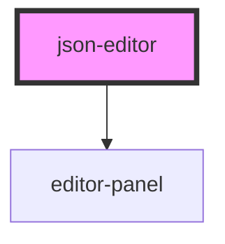

# json-editor

<!-- Auto Generated Below -->

## Properties

| Property   | Attribute  | Description                                    | Type                                                                                                                                                                                                                                  | Default     |
| ---------- | ---------- | ---------------------------------------------- | ------------------------------------------------------------------------------------------------------------------------------------------------------------------------------------------------------------------------------------- | ----------- |
| `readonly` | `readonly` |                                                | `boolean`                                                                                                                                                                                                                             | `false`     |
| `theme`    | `theme`    | Theme of the editor                            | `"amy" \| "ayuLight" \| "barf" \| "bespin" \| "birdsOfParadise" \| "boysAndGirls" \| "clouds" \| "cobalt" \| "coolGlow" \| "dracula" \| "espresso" \| "noctisLilac" \| "rosePineDawn" \| "smoothy" \| "solarizedLight" \| "tomorrow"` | `undefined` |
| `value`    | `value`    | Value that will be displayed inside the editor | `string`                                                                                                                                                                                                                              | `undefined` |

## Dependencies

### Depends on

- [editor-panel](../editor-panel)

### Graph

----------------------------------------------

*Built with [StencilJS](https://stenciljs.com/)*
