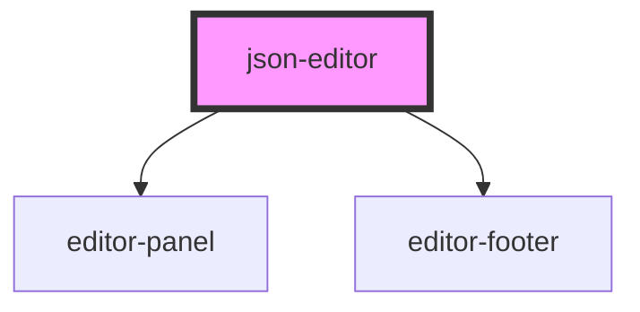

# json-editor

<!-- Auto Generated Below -->

## Properties

| Property           | Attribute            | Description                                    | Type                                                                                                                                                                                                                                  | Default     |
| ------------------ | -------------------- | ---------------------------------------------- | ------------------------------------------------------------------------------------------------------------------------------------------------------------------------------------------------------------------------------------- | ----------- |
| `footerConfig`     | --                   |                                                | `{ backgroundColor: string; color: string; }`                                                                                                                                                                                         | `undefined` |
| `mode`             | `mode`               |                                                | `"json" \| "text"`                                                                                                                                                                                                                    | `'json'`    |
| `readonly`         | `readonly`           |                                                | `boolean`                                                                                                                                                                                                                             | `false`     |
| `showActionsPanel` | `show-actions-panel` |                                                | `boolean`                                                                                                                                                                                                                             | `undefined` |
| `showFooter`       | `show-footer`        |                                                | `boolean`                                                                                                                                                                                                                             | `undefined` |
| `theme`            | `theme`              | Theme of the editor                            | `"amy" \| "ayuLight" \| "barf" \| "bespin" \| "birdsOfParadise" \| "boysAndGirls" \| "clouds" \| "cobalt" \| "coolGlow" \| "dracula" \| "espresso" \| "noctisLilac" \| "rosePineDawn" \| "smoothy" \| "solarizedLight" \| "tomorrow"` | `undefined` |
| `value`            | `value`              | Value that will be displayed inside the editor | `string`                                                                                                                                                                                                                              | `undefined` |

## Events

| Event          | Description | Type                  |
| -------------- | ----------- | --------------------- |
| `editorChange` |             | `CustomEvent<string>` |

## Methods

### `foldAll() => Promise<void>`

#### Returns

Type: `Promise<void>`

### `unfoldAll() => Promise<void>`

#### Returns

Type: `Promise<void>`

## Dependencies

### Depends on

- [editor-panel](../editor-panel)
- [editor-footer](../editor-footer)

### Graph

----------------------------------------------

*Built with [StencilJS](https://stenciljs.com/)*
