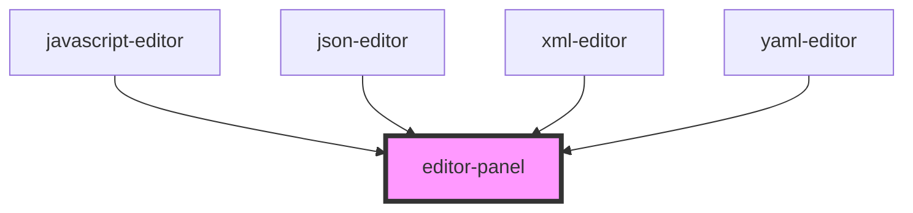

# editor-panel

<!-- Auto Generated Below -->

## Dependencies

### Used by

 - [javascript-editor](../../components/javascript-editor)
 - [json-editor](../../components/json-editor)
 - [xml-editor](../../components/xml-editor)
 - [yaml-editor](../../components/yaml-editor)

### Graph

----------------------------------------------

*Built with [StencilJS](https://stenciljs.com/)*
